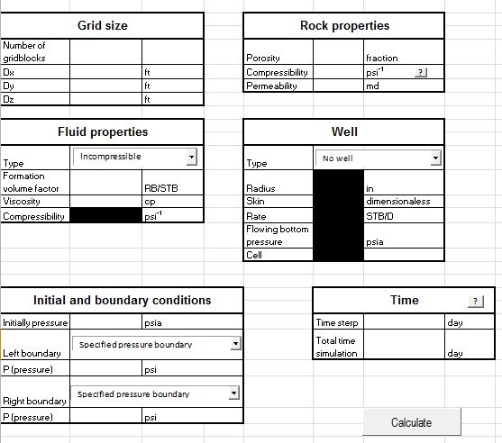
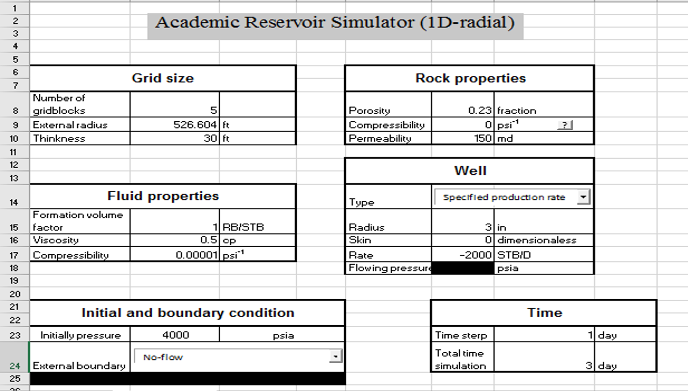

```{r setup, include=FALSE}
knitr::opts_chunk$set(echo = FALSE)
```

We want to share some excel spreadsheets about basic reservoir simulation and waterflooding based on 
Abou-Kassem et. al. (2006) and Willhite (1986)

ARS (Cartesian)

ARS is a basic reservoir simulation spreadsheet. With ARS you can do examples 
considering the follow features:

    -One dimension
    -One phase (oil)
    -Incompressible or Slightly compressible fluid
    -Rock porosity constant or depending of pressure
    -5 different types of boundary conditions
    -One well (specified production rate or specified flowing pressure)
    
{width=100%}

Academic Reservoir Simulator (1D - radial)

With ARS (1D - radial) you can do examples considering the follow features:

-One dimension in radial coordinates
-One phase (oil)
-Slightly compressible fluid
-Rock porosity constant or depending of pressure
-4 different types of boundary conditions
-Well with specified production rate or specified flowing pressure)

{width=100%}
ARS (1D - radial-Fractured)

ARS (1D - radial-Fractured) is part of a serie of basic reservoir simulation spreadsheets. With ARS (1D - radial-Fractured) you can do examples considering the follow features:

Naturally fractured reservoir (Warren and Root model)
One dimension in radial coordinates
One phase (oil)
Slightly compressible fluid
Rock porosity depending of pressure
4 different types of boundary conditions
Well with specified production rate or specified flowing pressure)

You will need the petrophysics properties of matrix and fracture (Porosity, compressibility, permeability and matrix-fracture shape fracture). You have the option to use a constant or variable time step.

{width=100%}

In the follow image you can observe the double slope expected from the Warren and Root model.

{width=100%}
Academic WaterFlooding (AWF)

AWF is part of a serie of basic reservoir engineering spreadsheets. With AWD you can do examples using thw Buckley-Leverett model and Welge solution estimating the displacement performance for a linear waterflood at constant injection rate.The necessary data is shown in the next picture.

{width=100%}


AWF calculates the Sw at breakthrough and generates three differents charts:

-Sw vs fw
-time vs Qo
-x vs Sw 


Also it calculates Np, WOR and Qo at differents times. Download it and tell us what you think.

{width=100%}
{width=100%}


[Files](https://github.com/chatosolutions/Spreadsheets)

References

Abou-Kassen, J.H.; Farouq, S. M. and Rafiq, M (2006) Petroleum reservoir simulation A basic approach.
Willhite, G. P. (1986) Waterflooding 
